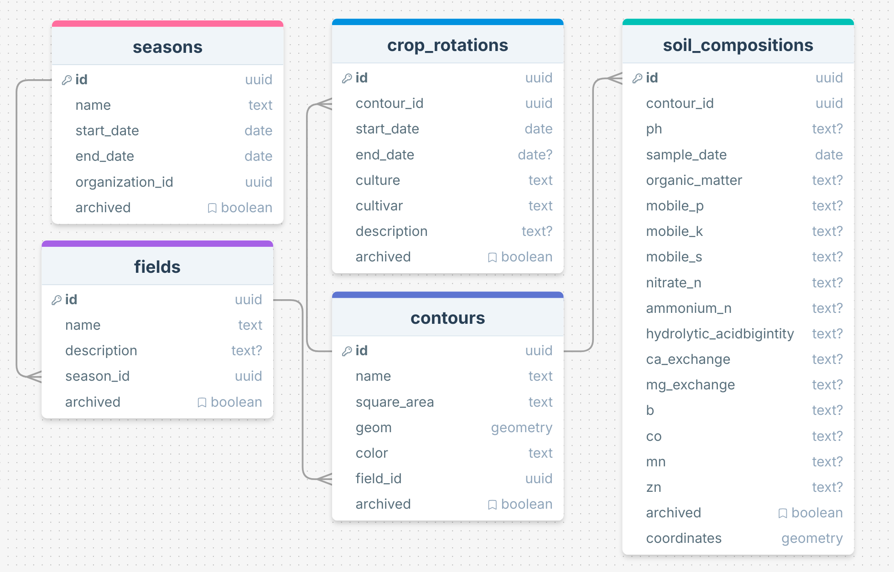
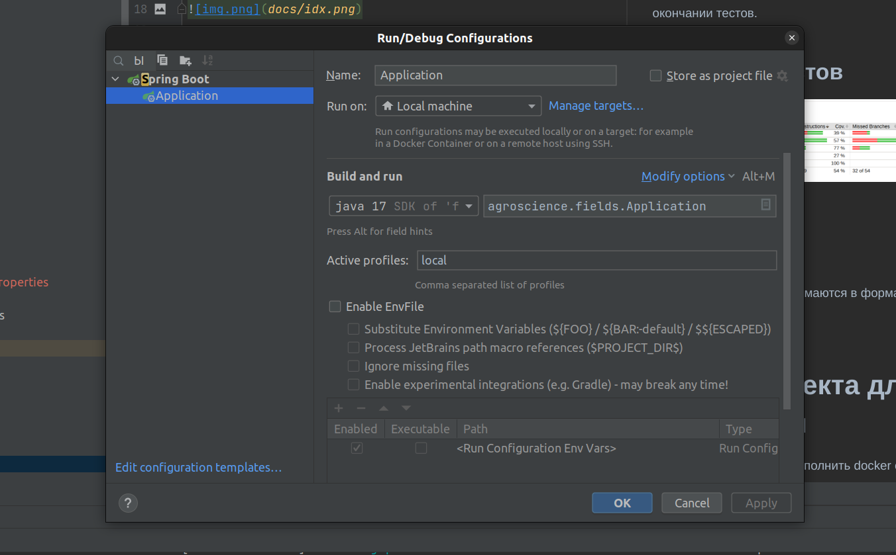
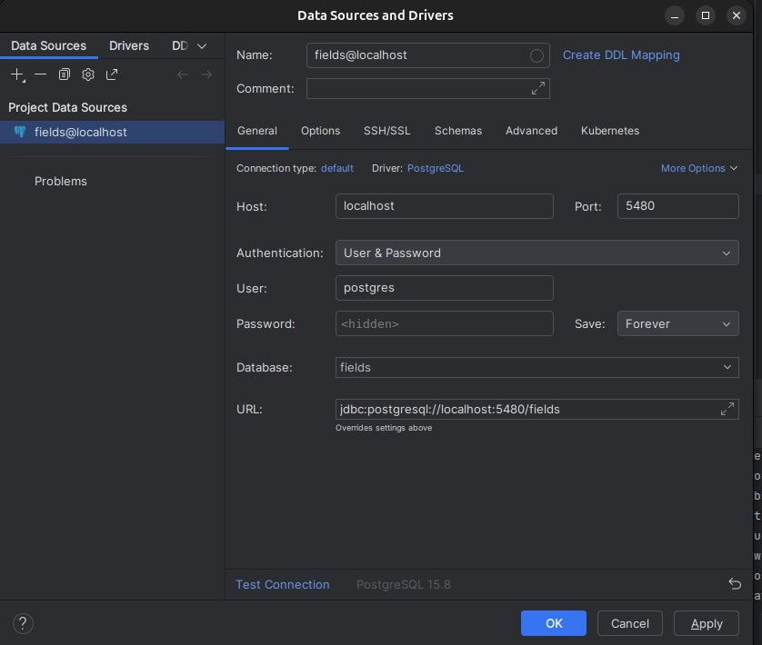

# Agro-Fields-Service

## ER-диаграмма

## ТЗ, оформленное в XML, корректное относительно DTD

https://drive.google.com/drive/u/2/folders/17T1dHprTmO6PLgx6iELyzmfuGqAupTuV

## Сборка и запуск проекта

1. Установить [docker](https://docs.docker.com/install/overview/) и [docker-compose](https://docs.docker.com/compose/install/)
   
2. На ubuntu лучше настроить [использование докера без sudo](https://askubuntu.com/questions/477551/how-can-i-use-docker-without-sudo)

3. Загрузить проект из репозитория

```sh
git clone git@github.com:FergeSS/AgroFieldsService.git
``` 
4. Сборка и запуск контейнера локально
```sh
cd ./local
docker compose up -d --build
```
5. Сборка и запуск проекта
Указать профиль local при запуске. Сваггер http://localhost:8080/docs


6.Настройка БД


7. Перейти на Swagger

Для ручного тестирования необходимо проставить jwt токен в окошко Authorize в сваггере.  
После этого любой запрос будет содержать токен, который вы вставили.


## Описание
Микросервис создан в рамках проходимой учебной практики осеннего семестра 2024 г. для проекта "Геоинформационные системы земледелия" студентом Юхновым Александром.  
Микросервис предназначен для управления данными, связанными с сельскохозяйственными сезонами, полями, их контурами, севооборотами и химическим составом почвы. Он обеспечивает взаимодействие с базой данных для хранения, обработки и анализа информации, а также предоставляет интерфейсы для работы с этими данными через API.

---

## Наименование
**AgroFieldsService**

---

## Предметная область
Система для точечного земледелия.

---

# Данные

### Таблица `seasons`
- `id` — уникальный идентификатор (UUID), первичный ключ.
- `name` — строка длиной от 1 до 50 символов, обязательное поле, уникальное в рамках одной организации.
- `start_date` — дата, обязательное поле, должна быть меньше или равна `end_date` (контроль со стороны пользователя).
- `end_date` — дата, обязательное поле.
- `organization_id` — уникальный идентификатор (UUID), внешний ключ, ссылается на таблицу организаций.
- `archived` — булевое значение (true/false), по умолчанию `false`.

### Таблица `fields`
- `id` — уникальный идентификатор (UUID), первичный ключ.
- `name` — строка длиной от 1 до 50 символов, обязательное поле, уникальное в рамках одной организации.
- `description` — описание поля (необязательное поле).
- `season_id` — уникальный идентификатор (UUID), внешний ключ, ссылается на `seasons.id`.
- `archived` — булевое значение (true/false), по умолчанию `false`.

### Таблица `contours`
- `id` — уникальный идентификатор (UUID), первичный ключ.
- `name` — строка длиной от 1 до 50 символов, обязательное поле.
- `square_area` — строка, обязательное поле, содержит значение площади (например, в гектарах).
- `geom` — геометрическое поле (координаты), обязательное поле.
- `color` — строка, HEX-код цвета (например, `#FFFFFF`), обязательное поле.
- `field_id` — уникальный идентификатор (UUID), внешний ключ, ссылается на `fields.id`.
- `archived` — булевое значение (true/false), по умолчанию `false`.

### Таблица `crop_rotations`
- `id` — уникальный идентификатор (UUID), первичный ключ.
- `contour_id` — уникальный идентификатор (UUID), внешний ключ, ссылается на `contours.id`.
- `start_date` — дата, обязательное поле, должна быть меньше или равна `end_date` (контроль со стороны пользователя).
- `end_date` — дата (необязательное поле).
- `culture` — строка длиной от 1 до 50 символов, обязательное поле.
- `cultivar` — строка длиной от 1 до 50 символов, обязательное поле.
- `description` — текстовое описание (необязательное поле).
- `archived` — булевое значение (true/false), по умолчанию `false`.

### Таблица `soil_compositions`
- `id` — уникальный идентификатор (UUID), первичный ключ.
- `contour_id` — уникальный идентификатор (UUID), внешний ключ, ссылается на `contours.id`.
- `ph` — строка, может содержать значения от 0 до 14 (необязательное поле).
- `sample_date` — дата, обязательное поле.
- `organic_matter`, `mobile_p`, `mobile_k`, `mobile_s`, `nitrate_n`, `ammonium_n`, `hydrolytic_acidity`, `ca_exchange`, `mg_exchange`, `b`, `co`, `mn`, `zn` — строковые поля, допускающие положительные значения или null.
- `archived` — булевое значение (true/false), по умолчанию `false`.
- `coordinates` — геометрическое поле типа POINT с системой координат 4321, обязательное поле.

---

## Общие ограничения целостности
1. Связь между таблицами `fields`, `contours`, `crop_rotations` и `soil_compositions` через внешний ключ.
2. Архивированные записи (`archived = true`) не должны использоваться в расчётах и отчетах.
3. Уникальные индексы для идентификаторов (`id`) и значимых полей (`name` для `fields` и `contours`).

---

# Пользовательские роли

## 1. Агроном (Администратор)
- **Ответственность**:
  - Полный контроль над сервисом.
  - Управление настройками и функционалом.
  - Обработка данных (например, управление полями, культурами, урожайностью).
- **Количество пользователей**: 1 (агроном, который также выполняет функции администратора).

## Примечание
Сервис пока что рассчитан на одного пользователя (агронома). В случае расширения функционала и появления дополнительных ролей (например, менеджеров или рабочих), структура может быть дополнена.

---

# API

## Seasons API

### Описание
API для управления полями и сезонами.

### Версия
2.0.0

---

## Пути (Paths)

### Seasons

#### Создание нового сезона
- **Метод**: `POST`
- **Путь**: `/api/v2/fields-service/season`
- **Описание**: Создает новый сезон.
- **Тело запроса**:
  - **Тип**: `application/json`
  - **Схема**: `SeasonBaseDTO`
- **Ответы**:
  - **200**: ID созданного сезона (`IdDTO`)
  - **400**: Неверный запрос (`BadRequest`)
  - **500**: Внутренняя ошибка сервера (`InternalError`)

#### Изменение сезона
- **Метод**: `PUT`
- **Путь**: `/api/v2/fields-service/season`
- **Описание**: Изменяет существующий сезон.
- **Параметры**:
  - `id` (строка, обязательный, формат UUID) — ID сезона.
- **Тело запроса**:
  - **Тип**: `application/json`
  - **Схема**: `SeasonBaseDTO`
- **Ответы**:
  - **200**: Изменение выполнено успешно.
  - **400**: Неверный запрос (`BadRequest`)
  - **500**: Внутренняя ошибка сервера (`InternalError`)

#### Удаление сезона
- **Метод**: `DELETE`
- **Путь**: `/api/v2/fields-service/season`
- **Описание**: Удаляет сезон по его ID.
- **Параметры**:
  - `id` (строка, обязательный, формат UUID) — ID сезона.
- **Ответы**:
  - **200**: Сезон успешно удален.
  - **400**: Неверный запрос (`BadRequest`)
  - **500**: Внутренняя ошибка сервера (`InternalError`)

#### Получение всех сезонов организации без полей
- **Метод**: `GET`
- **Путь**: `/api/v2/fields-service/seasons`
- **Описание**: Возвращает список всех сезонов организации без полей.
- **Ответы**:
  - **200**: Список сезонов (`SeasonBaseDTO`)
  - **400**: Неверный запрос (`BadRequest`)
  - **500**: Внутренняя ошибка сервера (`InternalError`)

#### Получение всех сезонов организации с полями
- **Метод**: `GET`
- **Путь**: `/api/v2/fields-service/seasons/full`
- **Описание**: Возвращает список всех сезонов организации с полями.
- **Ответы**:
  - **200**: Список сезонов (`SeasonWithFieldsDTO`)
  - **400**: Неверный запрос (`BadRequest`)
  - **500**: Внутренняя ошибка сервера (`InternalError`)

---

### Contours (Контуры)

#### Получение контуров по ID поля
- **Метод**: `GET`
- **Путь**: `/api/v2/fields-service/fields/{id}/contours`
- **Описание**: Возвращает контуры по ID поля.
- **Параметры**:
  - `id` (строка, обязательный, формат UUID) — ID поля.
- **Ответы**:
  - **200**: Список контуров (`ContourBaseDTO`)
  - **400**: Неверный запрос (`BadRequest`)
  - **500**: Внутренняя ошибка сервера (`InternalError`)

#### Удаление контура по ID
- **Метод**: `DELETE`
- **Путь**: `/api/v2/fields-service/contour`
- **Описание**: Удаляет контур по его ID.
- **Параметры**:
  - `id` (строка, обязательный, формат UUID) — ID контура.
- **Ответы**:
  - **200**: Контур успешно удален.
  - **400**: Неверный запрос (`BadRequest`)
  - **500**: Внутренняя ошибка сервера (`InternalError`)

#### Изменение контура
- **Метод**: `PUT`
- **Путь**: `/api/v2/fields-service/contour`
- **Описание**: Изменяет существующий контур.
- **Параметры**:
  - `id` (строка, обязательный, формат UUID) — ID контура.
- **Тело запроса**:
  - **Тип**: `application/json`
  - **Схема**: `UpdateContourDTO`
- **Ответы**:
  - **200**: Изменение выполнено успешно.
  - **400**: Неверный запрос (`BadRequest`)
  - **500**: Внутренняя ошибка сервера (`InternalError`)

#### Добавление нового контура к существующему полю
- **Метод**: `POST`
- **Путь**: `/api/v2/fields-service/fields/{id}/contour`
- **Описание**: Добавляет новый контур к существующему полю.
- **Параметры**:
  - `id` (строка, обязательный, формат UUID) — ID поля.
- **Тело запроса**:
  - **Тип**: `application/json`
  - **Схема**: `ContourBaseDTO`
- **Ответы**:
  - **200**: Контур добавлен к полю (`IdDTO`)
  - **400**: Неверный запрос (`BadRequest`)
  - **500**: Внутренняя ошибка сервера (`InternalError`)

---

### Fields (Поля)

#### Создание нового поля в существующем сезоне
- **Метод**: `POST`
- **Путь**: `/api/v2/fields-service/seasons/{id}/field`
- **Описание**: Создает новое поле в существующем сезоне.
- **Параметры**:
  - `id` (строка, обязательный, формат UUID) — ID сезона.
- **Тело запроса**:
  - **Тип**: `application/json`
  - **Схема**: `FieldDTO`
- **Ответы**:
  - **200**: ID созданного поля (`IdDTO`)
  - **400**: Неверный запрос (`BadRequest`)
  - **500**: Внутренняя ошибка сервера (`InternalError`)

#### Получение всех полей по ID сезона
- **Метод**: `GET`
- **Путь**: `/api/v2/fields-service/seasons/{id}/fields`
- **Описание**: Возвращает список всех полей по ID сезона.
- **Параметры**:
  - `id` (строка, обязательный, формат UUID) — ID сезона.
- **Ответы**:
  - **200**: Список полей с последней ротацией культур (`FieldWithContoursAndCropRotationsDTO`)
  - **400**: Неверный запрос (`BadRequest`)
  - **500**: Внутренняя ошибка сервера (`InternalError`)

#### Удаление поля по ID
- **Метод**: `DELETE`
- **Путь**: `/api/v2/fields-service/field`
- **Описание**: Удаляет поле по его ID.
- **Параметры**:
  - `id` (строка, обязательный, формат UUID) — ID поля.
- **Ответы**:
  - **200**: Поле успешно удалено.
  - **400**: Неверный запрос (`BadRequest`)
  - **500**: Внутренняя ошибка сервера (`InternalError`)

#### Изменение поля
- **Метод**: `PUT`
- **Путь**: `/api/v2/fields-service/field`
- **Описание**: Изменяет существующее поле.
- **Параметры**:
  - `id` (строка, обязательный, формат UUID) — ID поля.
- **Тело запроса**:
  - **Тип**: `application/json`
  - **Схема**: `FieldBaseDTO`
- **Ответы**:
  - **200**: Изменение выполнено успешно.
  - **400**: Неверный запрос (`BadRequest`)
  - **500**: Внутренняя ошибка сервера (`InternalError`)

---

### MeteoSlave

#### Получение координат для метео-сервиса
- **Метод**: `GET`
- **Путь**: `/api/internal/fields-service/fields/all-coordinates`
- **Описание**: Возвращает координаты для метео-сервиса.
- **Ответы**:
  - **200**: Список координат (`MeteoResponse`)
  - **400**: Неверный запрос (`BadRequest`)
  - **500**: Внутренняя ошибка сервера (`InternalError`)

---

### CropRotations (Ротация культур)

#### Создание новой ротации культур
- **Метод**: `POST`
- **Путь**: `/api/v2/fields-service/contours/{id}/crop-rotation`
- **Описание**: Создает новую ротацию культур.
- **Параметры**:
  - `id` (строка, обязательный, формат UUID) — ID контура.
- **Тело запроса**:
  - **Тип**: `application/json`
  - **Схема**: `CropRotationDTO`
- **Ответы**:
  - **200**: ID созданной ротации культур (`IdDTO`)
  - **400**: Неверный запрос (`BadRequest`)
  - **500**: Внутренняя ошибка сервера (`InternalError`)

#### Получение ротаций культур по ID контура
- **Метод**: `GET`
- **Путь**: `/api/v2/fields-service/contours/{id}/crop-rotations`
- **Описание**: Возвращает ротации культур по ID контура.
- **Параметры**:
  - `id` (строка, обязательный, формат UUID) — ID контура.
- **Ответы**:
  - **200**: Список ротаций культур (`CropRotationDTO`)
  - **400**: Неверный запрос (`BadRequest`)
  - **500**: Внутренняя ошибка сервера (`InternalError`)

#### Удаление ротации культур по ID
- **Метод**: `DELETE`
- **Путь**: `/api/v2/fields-service/crop-rotation`
- **Описание**: Удаляет ротацию культур по её ID.
- **Параметры**:
  - `id` (строка, обязательный, формат UUID) — ID ротации культур.
- **Ответы**:
  - **200**: Ротация культур успешно удалена.
  - **400**: Неверный запрос (`BadRequest`)
  - **500**: Внутренняя ошибка сервера (`InternalError`)

#### Изменение ротации культур
- **Метод**: `PUT`
- **Путь**: `/api/v2/fields-service/crop-rotation`
- **Описание**: Изменяет существующую ротацию культур.
- **Параметры**:
  - `id` (строка, обязательный, формат UUID) — ID ротации культур.
- **Тело запроса**:
  - **Тип**: `application/json`
  - **Схема**: `CropRotationDTO`
- **Ответы**:
  - **200**: Изменение выполнено успешно.
  - **400**: Неверный запрос (`BadRequest`)
  - **500**: Внутренняя ошибка сервера (`InternalError`)

---

### SoilCompositions (Состав почвы)

#### Создание нового состава почвы для существующего контура
- **Метод**: `POST`
- **Путь**: `/api/v2/fields-service/contours/{id}/soil-composition`
- **Описание**: Создает новый состав почвы для существующего контура.
- **Параметры**:
  - `id` (строка, обязательный, формат UUID) — ID контура.
- **Тело запроса**:
  - **Тип**: `application/json`
  - **Схема**: `SoilCompositionDTO`
- **Ответы**:
  - **200**: ID созданного состава почвы (`IdDTO`)
  - **400**: Неверный запрос (`BadRequest`)
  - **500**: Внутренняя ошибка сервера (`InternalError`)

#### Получение составов почвы по ID контура
- **Метод**: `GET`
- **Путь**: `/api/v2/fields-service/contours/{id}/soil-compositions`
- **Описание**: Возвращает составы почвы по ID контура.
- **Параметры**:
  - `id` (строка, обязательный, формат UUID) — ID контура.
- **Ответы**:
  - **200**: Список составов почвы (`SoilCompositionDTO`)
  - **400**: Неверный запрос (`BadRequest`)
  - **500**: Внутренняя ошибка сервера (`InternalError`)

#### Изменение состава почвы
- **Метод**: `PUT`
- **Путь**: `/api/v2/fields-service/soil-composition`
- **Описание**: Изменяет существующий состав почвы.
- **Параметры**:
  - `id` (строка, обязательный, формат UUID) — ID состава почвы.
- **Тело запроса**:
  - **Тип**: `application/json`
  - **Схема**: `SoilCompositionDTO`
- **Ответы**:
  - **200**: Изменение выполнено успешно.
  - **400**: Неверный запрос (`BadRequest`)
  - **500**: Внутренняя ошибка сервера (`InternalError`)

#### Удаление состава почвы по ID
- **Метод**: `DELETE`
- **Путь**: `/api/v2/fields-service/soil-composition`
- **Описание**: Удаляет состав почвы по его ID.
- **Параметры**:
  - `id` (строка, обязательный, формат UUID) — ID состава почвы.
- **Ответы**:
  - **200**: Состав почвы успешно удален.
  - **400**: Неверный запрос (`BadRequest`)
  - **500**: Внутренняя ошибка сервера (`InternalError`)

---

## Основные технологии

1. **Spring Framework**
   - **Spring Boot**: Фреймворк для упрощения создания приложений на основе Spring. Он предоставляет автоконфигурацию и встроенные серверы (например, Tomcat).
   - **Spring Data JPA**: Упрощает взаимодействие с базами данных, предоставляя абстракцию для работы с сущностями и репозиториями.

2. **OpenAPI**
   - **OpenAPI Specification**: Стандарт для описания RESTful API. Используется для автоматической генерации документации и клиентских SDK.
   - **Springdoc OpenAPI**: Библиотека для интеграции OpenAPI с Spring Boot, позволяющая автоматически генерировать спецификацию API.

3. **Hibernate**
   - **Hibernate ORM**: ORM-фреймворк, который позволяет работать с базой данных через объекты Java, а не через SQL-запросы.
   - **Hibernate Validator**: Библиотека для валидации данных на уровне объектов.

4. **JPA (Java Persistence API)**
   - **JPA**: Стандартный API для работы с базами данных в Java. Hibernate является одной из реализаций JPA.
   - **Entity**: Аннотации для описания сущностей в базе данных.
   - **Repository**: Интерфейсы для работы с данными через JPA.

5. **Java**
   - **Java 17 (или выше)**: Современная версия языка Java, используемая для разработки приложений.
   - **Maven/Gradle**: Системы сборки проектов, используемые для управления зависимостями и сборки приложения.

6. **PostgreSQL**
   - **PostgreSQL**: Реляционная база данных, используемая для хранения данных приложения.
   - **JDBC**: Драйвер для подключения к базе данных PostgreSQL из Java-приложения.

---

# Тестирование

Тесты выполнялись с помощью библиотеки **JUnit 5**.  
Команда для запуска интеграционного тестирования:

./mvn clean test 

Тестирование проводится с помощью тестового контейнера в докере.
Контейнер поднимается и удаляется автоматически при запуске и окончании тестов.
